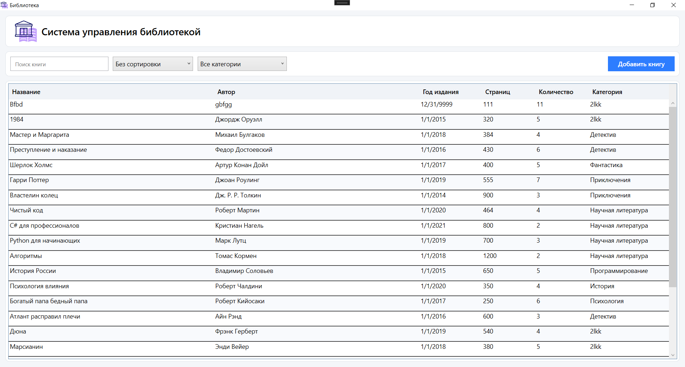
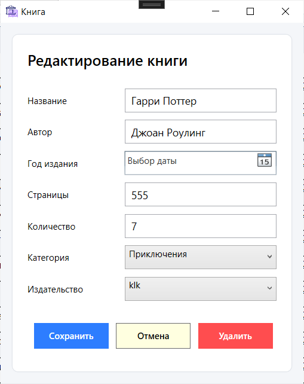
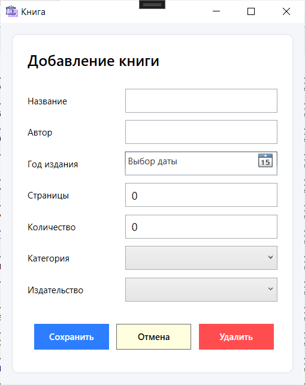

# Предметная область и ERD
### ERD диаграмма по курсовому проекту

[PDF версия](ERD_Book.pdf)

### Описание предметной области
[DOCX версия](Предметная%20область%20проекта.docx)

[PDF версия](Предметная%20область%20проекта.pdf)

### USE-Case диаграмма, диаграмма претендентов
[PNG версия](Use_case.png)

[PDF версия](Use_case.pdf)

### Словарь данных
[DOCX версия](Словарь%20данных.docx)

[PDF версия](Словарь%20данных.pdf)

### Фотки и описание по визуалу и функционалу приложения
Авторизация - после успешной авторизации пользователь перенаправляется на главное окно

Главный экран 

Функционал для админа редактирование книг

Добавление книг

