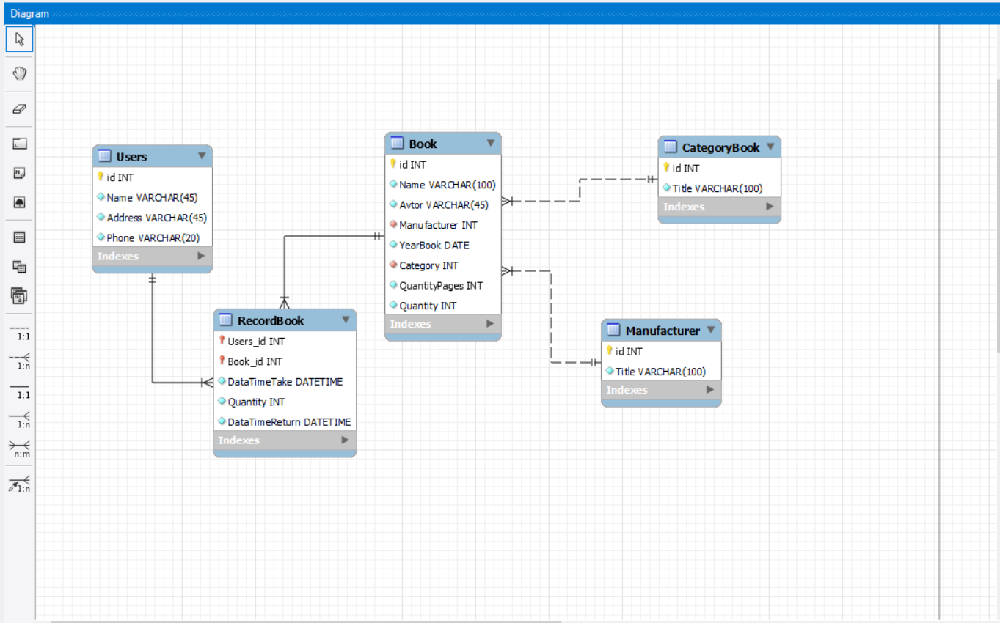

# Предметная область и ERD
### ERD диаграмма по курсовому проекту

[PDF версия](ERD_Book.pdf)

### Описание предметной области
[DOCX версия](Предметная%20область%20проекта.docx)

[PDF версия](Предметная%20область%20проекта.pdf)

### USE-Case диаграмма, диаграмма претендентов
[JPG версия](sequence_and_use_cases.jpg)

[PDF версия](sequence_and_use_cases.pdf)

### Словарь данных
[DOCX версия](Словарь%20данных.docx)

[PDF версия](Словарь%20данных.pdf)

### Фотки и описание по визуалу и функционалу сайта

Главный экран сайта

Нажатие кнопки "Перейти к покупкам", перекидывает в каталог

При нажатии на "В корзину" добавлилось в БД

Страница "О нас" с информацией о проекте

Страница с местоположением заведения, используется API Яндекс.Карт

Страница "Личного кабинета"

Страница "Админ-панели" где можно просматривать книги и удалять их, а так же смотреть список заказов

При удалении данные в БД обновляются

